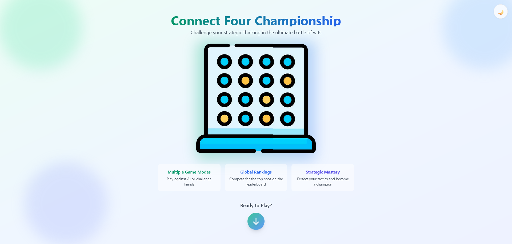
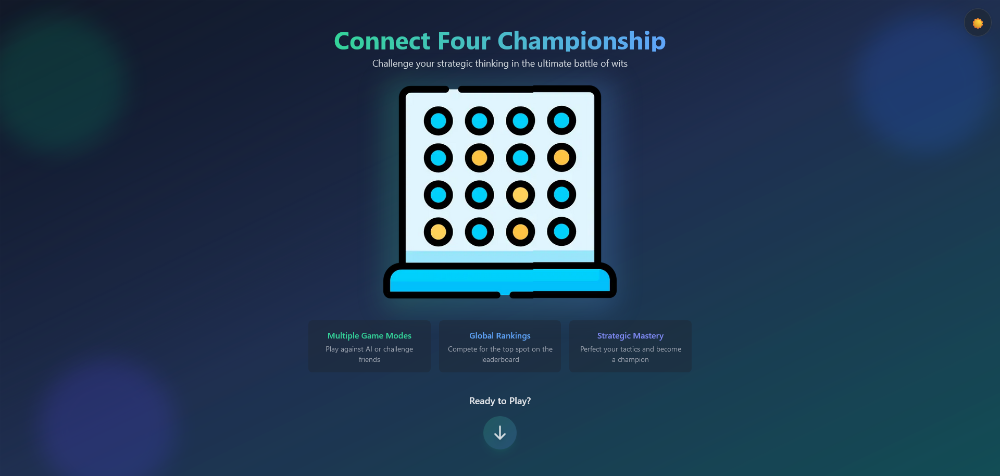
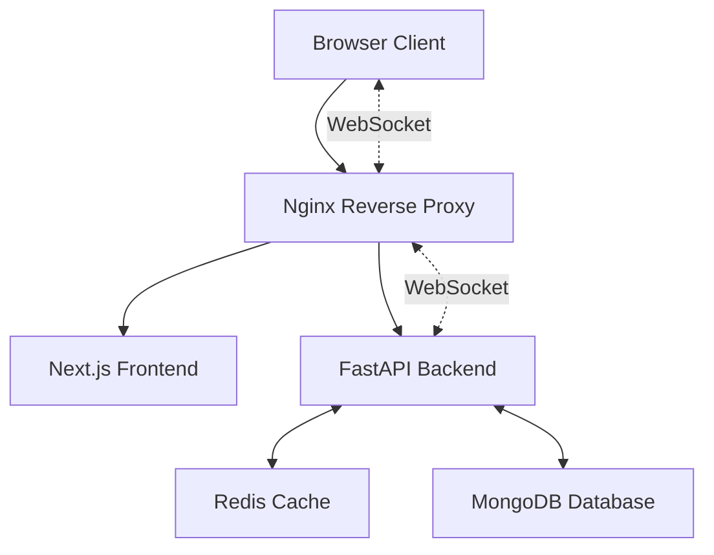

<div align="center">
    
    <h1>FourFury</h1>
    <p>A modern, real-time Connect Four game featuring AI opponents and online multiplayer</p>

[](https://fastapi.tiangolo.com/)
[](https://nextjs.org/)
[](https://www.python.org/)
[](https://www.typescriptlang.org/)
[](https://www.mongodb.com/)
[](https://redis.io/)
[](https://www.docker.com/)

[](https://opensource.org/licenses/MIT)
[](http://makeapullrequest.com)

</div>

## 🎮 Project Preview

<div align="center">
    <table>
        <tr>
            <td align="center">
                <strong>Light Mode</strong><br>
                
            </td>
            <td align="center">
                <strong>Dark Mode</strong><br>
                
            </td>
        </tr>
    </table>
</div>

## 📋 Table of Contents

- [Overview](#overview)
- [Live Demo](#live-demo)
- [Features](#features)
- [Technologies Used](#technologies-used)
- [Getting Started](#getting-started)
  - [Prerequisites](#prerequisites)
  - [Installation](#installation)
- [Usage](#usage)
- [Architecture](#architecture)
- [Development Journey](#development-journey)
  - [Achievements](#achievements)
  - [Challenges](#challenges)
  - [Lessons Learned](#lessons-learned)
- [Future Enhancements](#future-enhancements)
- [Team](#team)

## 📝 Overview

FourFury is a sophisticated implementation of the classic Connect Four game, built with modern web technologies. It offers multiple game modes including AI opponents with adjustable difficulty levels and real-time online multiplayer matches.

The project consists of:

- A robust FastAPI backend with Socket.IO for real-time communication
- A responsive Next.js frontend with smooth animations and intuitive controls
- Redis-powered caching and real-time features
- MongoDB for persistent data storage

For detailed technical documentation:

- [Frontend Documentation](./frontend/README.md)
- [Backend Documentation](./backend/README.md)

## 🎥 Live Demo

[.jpg)](https://drive.google.com/file/d/1FF2ER7ox5tWTjVs0UVCYG76Q8e69Yg6m/view)

## ⭐ Features

### Core Gameplay

- Multiple game modes:
  - Player vs AI with adjustable difficulty (1-5)
  - Local multiplayer
  - Online multiplayer with real-time updates
- Smart move validation and win detection
- Responsive design works on all devices
- Beautiful animations and visual effects
- Dark/Light theme support

### Online Features

- Anonymous play with persistent sessions
- Real-time game state synchronization
- Player presence tracking
- Automatic forfeit on disconnect
- Rematch system
- Game state preservation on refresh

### Technical Highlights

- Efficient game state management
- Real-time WebSocket communication
- Redis-powered caching system
- Scalable MongoDB backend
- Modern React frontend with Next.js
- Type-safe with TypeScript and Python type hints

## 🛠️ Technology Stack

<div align="center">
    <table>
        <tr>
            <td align="center">
                <br>
                <strong>Next.js</strong>
            </td>
            <td align="center">
                <br>
                <strong>TypeScript</strong>
            </td>
            <td align="center">
                <br>
                <strong>TailwindCSS</strong>
            </td>
            <td align="center">
                <br>
                <strong>Socket.IO</strong>
            </td>
        </tr>
        <tr>
            <td align="center">
                <br>
                <strong>FastAPI</strong>
            </td>
            <td align="center">
                <br>
                <strong>Python</strong>
            </td>
            <td align="center">
                <br>
                <strong>Redis</strong>
            </td>
            <td align="center">
                <br>
                <strong>MongoDB</strong>
            </td>
        </tr>
    </table>
</div>

For detailed technical specifications and setup instructions, please refer to the respective frontend and backend README files.

## 🚀 Getting Started

### 📋 Prerequisites

#### Docker Installation

- Docker Engine 24.0.0+
- Docker Compose V2 2.20.0+

#### Development Requirements

- For Frontend:
  - Node.js 20.0.0+
  - npm 10.0.0+ or Yarn 1.22.0+
- For Backend:
  - Python 3.10+
  - Poetry package manager
- MongoDB 7.0+
- Redis 7.2+

### ⚙️ Installation

#### Using Docker Compose (Recommended)

1. Clone the repository:

   ```bash
   git clone https://github.com/hackerSa3edy/FourFury.git
   cd FourFury
   ```

2. Configure environment variables:

   ```bash
   # For backend
   # Modify backend/.env.docker if needed (default values should work)

   # For frontend
   # Modify frontend/.env.docker if needed (default values should work)
   ```

3. Build and start the containers:

   ```bash
   docker compose up --build
   ```

4. Access the application:
   - Frontend: <http://localhost>
   - Backend API: <http://localhost/api>

#### Manual Installation

1. Clone the repository as shown above

2. Setup Frontend:

   ```bash
   cd frontend
   npm install
   cp .example.env.local .env.local
   # Modify .env.local with your configuration
   npm run build
   npm start
   ```

3. Setup Backend:

   ```bash
   cd backend
   poetry install
   cp .env.example .env
   # Modify .env with your configuration
   poetry run uvicorn src.fourfury.run:app --reload
   ```

4. Setup MongoDB and Redis locally

## 💻 Usage

### Docker Compose Services

Our docker-compose.yml sets up a complete development environment with five services:

1. **nginx** (Port 80):
   - Reverse proxy handling routing between frontend and backend
   - Load balancing and SSL termination (if configured)
   - Routes `/api/*` to backend
   - Routes `/socket.io/*` to backend WebSocket
   - Routes all other traffic to frontend
   - Handles SSL termination (in production)

2. **frontend** (Next.js):
   - Serves the React application
   - Automatically rebuilds on code changes
   - Connects to backend through nginx proxy

3. **backend** (FastAPI):
   - Handles API requests and WebSocket connections
   - Auto-reloads during development
   - Configured through .env.docker

4. **db** (MongoDB):
   - Persistent game data storage
   - Volume mounted for data persistence
   - Accessible to backend service

5. **redis** (Redis):
   - Handles caching and real-time features
   - Configured for keyspace notifications
   - Persists data through mounted volume

### Common Operations

- Rebuild single service:

  ```bash
  docker compose up -d --build [service_name]
  ```

- Reset data (clear volumes):

  ```bash
  docker compose down -v
  ```

- Check service status:

  ```bash
  docker compose ps
  ```

### Troubleshooting

1. If services fail to start:

   ```bash
   docker compose down
   docker compose up --build
   ```

2. Check service logs:

   ```bash
   docker compose logs [service_name]
   ```

3. Verify network connectivity:

   ```bash
   docker compose exec [service_name] ping [other_service]
   ```

## 🏗️ Architecture

### System Overview



### Repo Structure

```plaintext
FourFury
├── .gitignore
├── LICENSE
├── README.md
├── backend
│   ├── .dockerignore
│   ├── .env.docker
│   ├── .env.example
│   ├── .pre-commit-config.yaml
│   ├── Dockerfile
│   ├── Makefile
│   ├── README.md
│   ├── docs
│   ├── poetry.lock
│   ├── poetry.toml
│   ├── pyproject.toml
│   ├── src
│   └── tests
├── docker-compose.yml
├── frontend
│   ├── .env.docker
│   ├── .example.env.local
│   ├── .gitignore
│   ├── Dockerfile
│   ├── README.md
│   ├── eslint.config.mjs
│   ├── next.config.ts
│   ├── node_modules
│   ├── package-lock.json
│   ├── package.json
│   ├── postcss.config.mjs
│   ├── public
│   ├── src
│   ├── tailwind.config.ts
│   └── tsconfig.json
├── media
│   ├── Connect4_landing-darkMode.png
│   └── Connect4_landing-dayMode.png
└── nginx
    └── nginx.conf
```

## 🛣️ Development Journey

Our journey in developing FourFury has been both challenging and rewarding. This section outlines our key milestones, challenges, and learnings.

### 🏆 Achievements

- Successfully implemented a real-time multiplayer system using Socket.IO
- Created an efficient AI opponent with multiple difficulty levels
- Developed a responsive UI that works seamlessly across all devices
- Achieved sub-100ms move latency in online gameplay
- Built a scalable architecture capable of handling multiple concurrent games
- Implemented a robust game state management system
- Created an efficient winner detection algorithm
- Successfully integrated MongoDB for persistent storage
- Achieved 95%+ test coverage for core game logic
- Implemented efficient board serialization for state management

### 💪 Challenges

- Optimizing winner detection
  - Initial naive approach was too CPU-intensive
  - Solved by checking only affected rows/columns/diagonals
  - Implemented direction-based scanning for efficiency
  - Added caching for frequently checked positions

- Implementing efficient board representation
  - Balanced memory usage vs computation speed
  - Optimized array operations for move validation
  - Implemented efficient serialization for WebSocket transmission
  - Created compact state representation for persistence

- Real-time game synchronization
  - Handling network latency and disconnections
  - Managing race conditions in move validation
  - Implementing reliable state recovery
  - Ensuring consistent game state across players

- AI implementation challenges
  - Balancing AI difficulty levels
  - Optimizing minimax algorithm performance
  - Implementing efficient board evaluation
  - Managing computation time constraints

### 📚 Lessons Learned

- Technical Insights
  - WebSocket management requires careful error handling
  - State management is crucial for real-time applications
  - Efficient data structures significantly impact performance
  - Test-driven development is essential for game logic
  - Type safety prevents many runtime errors

- Architecture Decisions
  - Microservices architecture provides better scalability
  - Redis is excellent for real-time features
  - MongoDB's flexibility suits game state storage
  - Docker simplifies deployment and testing

- Development Process
  - Early performance optimization is sometimes necessary
  - Comprehensive testing saves debugging time
  - Documentation is crucial for complex game logic
  - Regular refactoring keeps code maintainable

- User Experience
  - Responsive design requires careful planning
  - Visual feedback is essential for game interactions
  - Accessibility cannot be an afterthought
  - Performance impacts user engagement

## 🔮 Future Enhancements

- [ ] Implement bitboard representation for faster win detection
- [ ] Optimize winner detection to check only around last move
- [ ] Add Google sign-in integration
- [ ] Implement:
  - [ ] Playing history
  - [ ] Leaderboard
  - [ ] Scoring system for both online and AI modes
  - [ ] User profiles
  - [ ] Data persistence for signed-in users

## 👥 Team

### 👨‍💻 Lead Developer

#### Abdelrahman Mohamed

- **Role**: Full Stack Developer
- **Contributions**:
  - System Architecture Design
  - Frontend Development (Next.js/React)
  - Backend Development (FastAPI/Python)
  - Real-time WebSocket Implementation
  - Docker Configuration
  - DevOps & Deployment
- **Contact**:
  - GitHub: [@hackerSa3edy](https://github.com/hackerSa3edy)
  - LinkedIn: [Abdelrahman Mohamed](https://www.linkedin.com/in/abdelrahmanm0/)

<div align="center">
    <p>
        
    </p>
    <hr>
    <p>
        <strong>Made with ❤️ as part of the ALX Software Engineering Program</strong>
    </p>
    <p>
        <a href="https://github.com/hackerSa3edy">
            
        </a>
        <a href="https://www.linkedin.com/in/abdelrahmanm0/">
            
        </a>
    </p>
</div>
