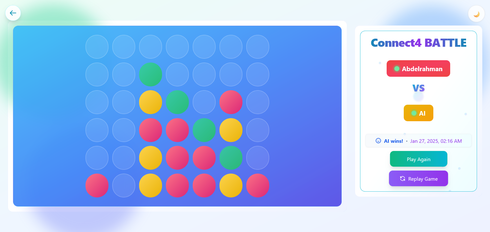
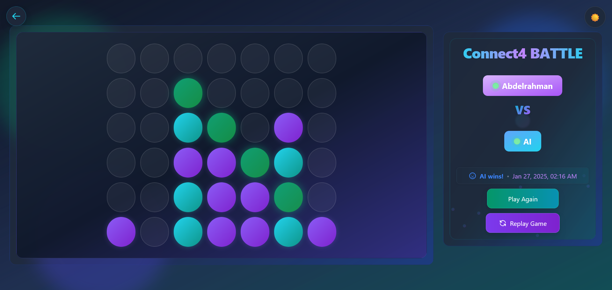

# 🎮 FourFury Frontend

> **Day Mode**



> **Dark Mode**



[](https://nextjs.org/)
[](https://www.typescriptlang.org/)
[](https://tailwindcss.com/)
[](https://socket.io/)

> A modern, real-time multiplayer Connect Four game built with Next.js and Socket.IO. Experience smooth gameplay, beautiful animations, and responsive design across all devices.

---

## 📋 Table of Contents

- [Quick Start](#-quick-start)
- [Technology Stack](#️-technology-stack)
- [Installation](#-installation)
- [Running the Application](#️-running-the-application)
- [Project Structure](#-project-structure)
- [Development Guidelines](#-development-guidelines)
- [Game Features](#-game-features)
  - [Core Gameplay](#core-gameplay)
  - [Player Experience](#player-experience)
- [UI Features](#-ui-features)
  - [Visual Effects](#visual-effects)
  - [User Experience](#user-experience)
- [Component Architecture](#-component-architecture)
  - [Core Components](#core-components)
  - [UI Components](#ui-components)
  - [Custom Hooks](#custom-hooks)
- [State Management](#-state-management)
- [Socket Events](#-socket-events)
- [Responsive Design](#-responsive-design-implementation)
- [Support](#-support)

## 🎯 Key Features

| 🎮 Real-time Multiplayer | 🎲 AI Opponents | 🌓 Dark/Light Modes | 📱 Mobile Responsive |
|------------------------|----------------|-------------------|-------------------|
| Live matchmaking system | Multiple difficulty levels | Theme customization | Adaptive layouts |
| Instant move updates | Strategic AI | Smooth transitions | Touch optimized |
| Player presence | Adaptive gameplay | Accessible design | Cross-device sync |

## 🚀 Quick Start

Before you begin, ensure you have the following installed:

- Node.js (v18.0.0 or higher)
- npm (v8.0.0 or higher) or yarn (v1.22.0 or higher)
- A modern web browser (Chrome, Firefox, Safari, Edge)

## 🛠️ Technology Stack

- **Framework:** Next.js 13+ (App Router)
- **Language:** TypeScript 5.0+
- **Styling:** TailwindCSS 3.0+
- **State Management:** React Context + Custom Hooks
- **Real-time Communication:** Socket.IO Client 4.0+
- **Development Tools:**
  - ESLint
  - Prettier
  - Husky
  - lint-staged

## 🔧 Installation

1. Clone the repository:

    ```bash
    git clone https://github.com/hackersa3edy/fourfury.git
    cd fourfury/frontend
    ```

2. Install dependencies:

    ```bash
    npm install
    # or
    yarn install
    ```

3. Configure environment variables:

    ```bash
    # Copy the example env file
    cp .example.env.local .env.local

    # Edit .env.local with your configuration
    nano .env.local
    ```

   Required environment variables:
   - `NEXT_PUBLIC_BACKEND_API_URL`: Your backend API URL
   - `NEXT_PUBLIC_SOCKETIO_URL`: Your Socket.IO server URL

## 🏃‍♂️ Running the Application

### Development Mode

```bash
npm run dev
# or
yarn dev
```

Access the app at `http://localhost:3000`

### Production Build

```bash
npm run build
npm run start
# or
yarn build
yarn start
```

## 📁 Project Structure

```plaintext
frontend/
├── Dockerfile
├── README.md
├── eslint.config.mjs
├── next-env.d.ts
├── next.config.ts
├── package-lock.json
├── package.json
├── postcss.config.mjs
├── public
│   ├── file.svg
│   ├── globe.svg
│   ├── next.svg
│   ├── vercel.svg
│   └── window.svg
├── src
│   ├── app
│   │   ├── favicon.ico
│   │   ├── games
│   │   │   └── [id]
│   │   │       ├── join
│   │   │       │   └── page.tsx
│   │   │       └── page.tsx
│   │   ├── globals.css
│   │   ├── layout.tsx
│   │   ├── page.tsx
│   │   └── providers.tsx
│   ├── components
│   │   ├── ExitWarningDialog.tsx
│   │   ├── GameBoard.tsx
│   │   ├── GameInfo.tsx
│   │   ├── WaitingPlayerToJoin.tsx
│   │   ├── buttons.tsx
│   │   ├── errors.tsx
│   │   ├── input.tsx
│   │   ├── mode-button.tsx
│   │   └── theme-button.tsx
│   ├── constants.tsx
│   ├── hooks
│   │   ├── useGamePresence.tsx
│   │   └── useGameRematch.tsx
│   ├── middleware.ts
│   ├── types
│   │   └── error.ts
│   └── utils
│       ├── errorHandler.ts
│       └── localStorageUtils.tsx
├── tailwind.config.ts
└── tsconfig.json

10 directories, 38 files
```

## 🔨 Development Guidelines

### Code Style

- Follow the project's ESLint and Prettier configurations
- Use functional components with hooks
- Implement proper TypeScript types
- Write meaningful comments for complex logic

## 🎮 Game Features

### Core Gameplay

- Real-time multiplayer Connect Four
- Smart win detection algorithm
- Game state preservation on refresh
- Automatic disconnect handling
- Rematch system with opponent approval
- Game replay functionality
- Room-based gameplay system

### Player Experience

- Player presence indicators
- Turn-based gameplay with visual cues
- Real-time move validation
- Dynamic scoring system
- Game chat functionality (coming soon)
- Custom game rooms (coming soon)

## 🔐 Session Management

### Game Sessions

- Games are tracked using browser cookies
- Each game session has a unique `game_id` cookie
- Session persistence allows game state recovery on refresh
- Middleware protection for game routes

### Route Protection

The application uses Next.js middleware to protect game routes:

- Homepage (`/`) is publicly accessible
- Game join routes (`/games/:id/join`) are open
- All other game routes (`/games/:id`) require valid session
- Invalid sessions are redirected to homepage

## 💅 UI Features

### Visual Effects

- Smooth disc drop animations
- Winning combination highlights
- Responsive grid animations
- Dark/Light theme transitions
- Loading state animations
- Floating particle effects
- Gradient animations

### User Experience

- Responsive design for all devices
- Keyboard navigation support
- Accessible color schemes
- Toast notifications
- Error handling with visual feedback
- Exit game confirmations
- Real-time status indicators

## 🧩 Component Architecture

### Core Components

#### `GameBoard`

- Manages the game grid and disc placement
- Handles win detection and turn management
- Implements drop animations and winning highlights
- Props:

  ```typescript
  interface GameBoardProps {
    gameData: GameData;
    socket: Socket | null;
    playerName: string
  }
  ```

- Where `GameData` props:

  ```typescript
    export interface GameData {
        id: string;
        player_1: string;
        player_1_username: string;
        player_2: string | null;
        player_2_username: string | null;
        move_number: number;
        movees: MovesData[];
        board: number[][];
        winner: number | null;
        next_player_to_move_username: string;
        finished_at: string | null;
        mode: string;
        ai_difficulty: number | null;
    }
  ```

#### `GameInfo`

- Displays game status and player information
- Shows current turn and scores
- Manages timer and game state
- Props:

  ```typescript
    interface GameInfoProps {
        gameData: GameData;
        handleReplayGame: () => void;
        handleRematch: () => void;
        handleCancelRematch: () => void;
        rematchStatus: string;
        presenceState: PresenceState;
        playerName: string;
        replayInProgress: boolean;
        forfeitMessage: string;
    }
  ```

### UI Components

#### `FourFuryButton`

- Customizable button component with variants
- Loading state animations
- Hover and active states
- Accessibility features

#### `ErrorComponents`

- Game not found error
- Connection error
- Loading states
- Network error handling

### Custom Hooks

#### `useGamePresence`

- Manages player connection status
- Handles reconnection logic
- Updates presence indicators

#### `useGameRematch`

- Controls rematch flow
- Manages rematch states
- Handles opponent responses

## 🔄 State Management

### Game State

```typescript
interface GameState {
  board: number[][];
  currentPlayer: string;
  status: GameStatus;
  players: PlayerInfo[];
  moves: Move[];
}
```

## 🔌 Socket Events

### Emitted Events (Client to Server)

#### Player Management

- `start_matching`: Begin matchmaking process

  ```typescript
  socket.emit('start_matching', playerUsername, playerName, sessionId)
  ```

- `cancel_matching`: Cancel active matchmaking

  ```typescript
  socket.emit('cancel_matching')
  ```

- `join_game_room`: Join a specific game room

  ```typescript
  socket.emit('join_game_room', gameId, status) // status: 'online'|'offline'
  ```

- `leave_game`: Leave current game room

  ```typescript
  socket.emit('leave_game', gameId)
  ```

- `forfeit`: Forfeit current game

  ```typescript
  socket.emit('forfeit', gameId)
  ```

### Received Events (Server to Client)

#### Connection Events

- `connect`: Socket connection established
- `connect_error`: Connection error occurred
- `disconnect`: Socket disconnected

#### Matchmaking Events

- `matching_status`: Updates on matchmaking progress

  ```typescript
  interface MatchingStatus {
    message: string;
  }
  ```

- `match_found`: Successfully matched with opponent

  ```typescript
  interface MatchFound {
    game: string; // JSON string containing game data
  }
  ```

- `matching_error`: Error during matchmaking

  ```typescript
  interface MatchingError {
    message: string;
  }
  ```

- `matching_cancelled`: Matchmaking was cancelled

#### Game Events

- `game_update`: Receive updated game state

  ```typescript
  interface GameUpdate {
    // Full game state data
    id: string;
    player_1: string;
    player_1_username: string;
    player_2: string;
    player_2_username: string;
    move_number: number;
    board: number[][];
    winner: number | null;
    // ...other game state properties
  }
  ```

### Error Handling

Socket events include robust error handling with proper fallbacks:

### Socket Events

- `game:move` - Player move
- `game:status` - Game status updates
- `player:join` - New player connection
- `player:leave` - Player disconnection
- `rematch:request` - Rematch handling

## 📱 Responsive Design Implementation

### Grid Layout System

The game uses a dynamic grid layout that adapts to different screen sizes:

```tsx
<div className="h-full grid grid-cols-1 lg:grid-cols-[1fr_minmax(300px,400px)] gap-[clamp(1rem,3vw,1.5rem)]">
```

This creates a single column layout on mobile that transforms into a two-column layout on larger screens, with the game info panel having a fixed width range.

### Fluid Typography and Spacing

Using clamp() for responsive values without breakpoints:

```tsx
className="text-[clamp(1rem,3vw,1.5rem)] p-[clamp(0.5rem,2vw,1rem)]"
```

This ensures text and spacing scales smoothly between minimum and maximum values based on viewport width.

### Mobile-First Game Board

The game board container uses dynamic sizing to maintain aspect ratio and fit different screens:

```tsx
className="w-full h-full max-h-[min(calc(100vh-8rem),calc(100vw-2rem))]
          lg:max-h-[min(calc(100vh-8rem),calc(100vw-400px))]
          aspect-square min-w-[320px] min-h-[320px]"
```

This ensures the board:

- Maintains a square aspect ratio
- Has minimum dimensions for playability
- Scales appropriately on both mobile and desktop

### Optimized Touch Interactions

Event listeners are configured for better mobile performance:

```tsx
useEffect(() => {
    const options = { passive: true };
    document.addEventListener('touchstart', () => {}, options);
    document.addEventListener('touchmove', () => {}, options);
    // ...cleanup code...
}, []);
```

This improves touch response time by telling the browser it won't prevent default behavior.

### Adaptive Backdrop Effects

Background effects are optimized for different devices:

```tsx
<div className="absolute inset-0 opacity-30 dark:opacity-20 overflow-hidden">
    <div className="absolute top-0 -left-4 w-96 h-96
         bg-emerald-400/70 dark:bg-emerald-600
         rounded-full mix-blend-multiply filter blur-xl animate-blob">
    </div>
    // ...more backdrop elements...
</div>
```

Features:

- Reduced opacity on dark mode for better visibility
- Overflow handling for smaller screens
- Performance-optimized animations

### Performance Optimizations

Device-specific rendering optimizations:

```tsx
style={{
    WebkitBackfaceVisibility: 'hidden',
    backfaceVisibility: 'hidden',
    WebkitPerspective: '1000',
    perspective: '1000',
    WebkitTransform: 'translate3d(0,0,0)',
    transform: 'translate3d(0,0,0)'
}}
```

These properties:

- Enable hardware acceleration
- Prevent flickering on scroll
- Improve animation performance on mobile devices

## 📦 Root Layout Optimizations

### Font Optimization

- Custom Inter font configuration with performance optimizations:
  - Uses `display: 'swap'` for faster initial render
  - Implements font variable for consistent usage
  - Includes comprehensive fallback fonts
  - Preloads font for better performance

### SEO & Metadata

- Comprehensive metadata configuration:
  - Dynamic title templates
  - Detailed site description
  - Optimized keywords
  - Author information
  - Multiple favicon sizes
  - Apple-specific icons
  - OpenGraph and Twitter card support

### Viewport Optimization

- Responsive viewport settings:
  - Dynamic theme color based on color scheme
  - Controlled scaling limits
  - Device-specific dimensions
  - Optimized for iOS safe areas
  - Touch highlight customization

### Performance Features

- Body optimizations:
  - Smooth gradient backgrounds
  - Hardware-accelerated transitions
  - Font smoothing
  - Overflow control
  - Touch scroll optimization
  - Text size adjustments

### Accessibility

- Language specification
- ARIA attributes
- Color contrast compliance
- Font size adjustment support
- Screen reader optimization

### Theme Support

- Dynamic dark/light mode
- Smooth theme transitions
- System preference detection
- Persistent theme selection
- Custom color schemes

## 🌟 Support

Give a ⭐️ if this project helped you!

---

Made with ❤️ by the FourFury Team
